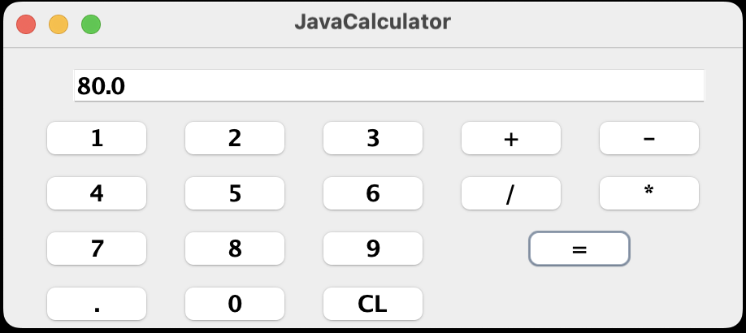

# Java Calculator 🧮

A simple GUI-based calculator built using Java Swing. This calculator performs basic arithmetic operations such as addition, subtraction, multiplication, and division.

## 🖥️ Features

- GUI built with **Java Swing**
- Supports:
  - Addition (+)
  - Subtraction (−)
  - Multiplication (×)
  - Division (÷)
- Handles decimal numbers using the point (`.`) button
- Clear button to reset the display
- Organized layout for easy interaction

## 📷 Screenshot



## 🛠️ How It Works

- Digits (0–9) and decimal point build the number in the display.
- Once an operator is clicked, the current value is stored and the text field is cleared for the second number.
- Pressing `=` calculates the result based on the selected operation.
- The `Clear` button resets the display and result variables.

## 🧾 Code Overview

- **JavaCalculator.java**
  - Contains the GUI and logic for calculator operations.
  - Uses `JTextField` for displaying the input and result.
  - Uses `JButton`s for digits and operations.
  - Implements `ActionListener` for button click handling.

## 📦 Requirements

- Java 8 or above
- An IDE like IntelliJ IDEA or Eclipse

## 🚀 Running the Application

1. Clone or download the repository.
2. Open the project in your favorite Java IDE.
3. Compile and run `JavaCalculator.java`.

```bash
javac JavaCalculator.java
java JavaCalculator
